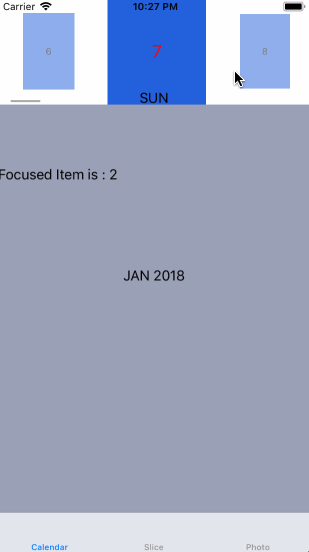

# Slippery

[](https://travis-ci.org/shawnbaek/Slippery)
[](http://cocoapods.org/pods/Slippery)
[](http://cocoapods.org/pods/Slippery)
[](http://cocoapods.org/pods/Slippery)

## Example

To run the example project, clone the repo, and run `pod install` from the Example directory first.

## Requirements

Swift 4.0
iOS 11.0

## Installation

Slippery is available through [CocoaPods](http://cocoapods.org). To install
it, simply add the following line to your Podfile:

```ruby
pod 'Slippery'
```

## Sample Project




## Author

shawnbaek, shawn@shawnbaek.com

twitter, @yoshiboarder

## License

Slippery is available under the MIT license. See the LICENSE file for more info.
