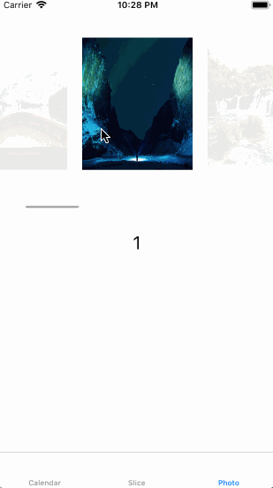

# Slippery

[](https://travis-ci.org/shawnbaek/Slippery)
[](http://cocoapods.org/pods/Slippery)
[](http://cocoapods.org/pods/Slippery)
[](http://cocoapods.org/pods/Slippery)

## Example

To run the example project, clone the repo, and run `pod install` from the Example directory first.

## Requirements

Swift 4.0
iOS 11.0

## Installation

Slippery is available through [CocoaPods](http://cocoapods.org). To install
it, simply add the following line to your Podfile:

```ruby
pod 'Slippery'
```

### Storyboard


Drag UICollectionViewController or UICollectionView in UIViewController


Set CollectionViewFlowLayout as `SlipperyFlowLayout`

That's It


## Center Mode

Center Mode has two options.

1. cropping


cropping mode is cropping the first and last cell

```Swift

highlightOption: .center(.cropping)

```

2. normal


first and the last cell is always positioning at center.

```Swift

highlightOption: .center(.normal)

```

## Custom Mode

You can set specifit focused position from leading to `first`, `second`, `third`, `fourth` and `fifth`

```Swift
highlightOption: .custom(.leading, .third)
```
Check Example of `SliceVC`


## Scale and Opacity Options

You can fully customizing focusing options.

```Swift
self.collectionViewLayout.minimumOpacityFactor = 0.1
self.collectionViewLayout.minimumScaleFactor = 1.0
```

e.g. `minimumScaleFactor = 1.0` means disable the scale mode
e.g. `minimumScaleFactor = 0.4` means set other cells scale as `0.4`


## Sample Project


```swift

func setupCollectionView(){

    self.collectionViewLayout = SlipperyFlowLayout.configureLayout(collectionView: self.calendarView, itemSize: CGSize(width: 120, height: 180), minimumLineSpacing: 10, highlightOption: .center(.cropping))
    self.collectionViewLayout.scaleItems = true
    self.collectionViewLayout.invalidateLayout()
    self.calendarView.layoutIfNeeded()

}

```


```swift

func setupCollectionView(){

    self.collectionViewLayout = SlipperyFlowLayout.configureLayout(collectionView: self.sliceView, itemSize: CGSize(width: 30, height: 180), minimumLineSpacing: 20, highlightOption: .custom(.leading, .third))

    self.collectionViewLayout.invalidateLayout()
    self.sliceView.layoutIfNeeded()

}

```



```swift
func setupCollectionView(){

    self.collectionViewLayout = SlipperyFlowLayout.configureLayout(collectionView: self.photoView, itemSize: CGSize(width: 150, height: 180), minimumLineSpacing: 20, highlightOption: .center(.normal))

    self.collectionViewLayout.invalidateLayout()
    self.photoView.layoutIfNeeded()

}
```

## scrollToItem

create a scrollToItem function in your ViewController

```swift
override func viewDidLoad() {
    super.viewDidLoad()
    createDummyNumbers()

    setupCollectionView()
    scrollToItem(item: 20, animated: true)
}

func createDummyNumbers(){

    for i in 0 ... 100 {
    dummyNumbers.append(i)
    }
}

override func viewWillAppear(_ animated: Bool) {
    super.viewWillAppear(animated)
    self.view.layoutIfNeeded()
}

func scrollToItem(item: Int, animated: Bool) {

    let itemOffset = self.collectionViewLayout.updateOffset(item: item)
    self.calendarView.setContentOffset(CGPoint(x: itemOffset, y: 0), animated: true)
    self.calendarView.layoutIfNeeded()

}

```


## Acknowledgment

I make this Library inspired by [LGLinearFlow](https://github.com/lukagabric/LGLinearFlow).
Thank you for sharing your code.

## Author

shawnbaek, shawn@shawnbaek.com


## Contact

I want to connect developers who loves iOS development. Follow me and Let's keep in touch. I want to make a friends! :smaile:
[twitter](https://twitter.com/yoshiboarder)


## License

Slippery is available under the MIT license. See the LICENSE file for more info.
